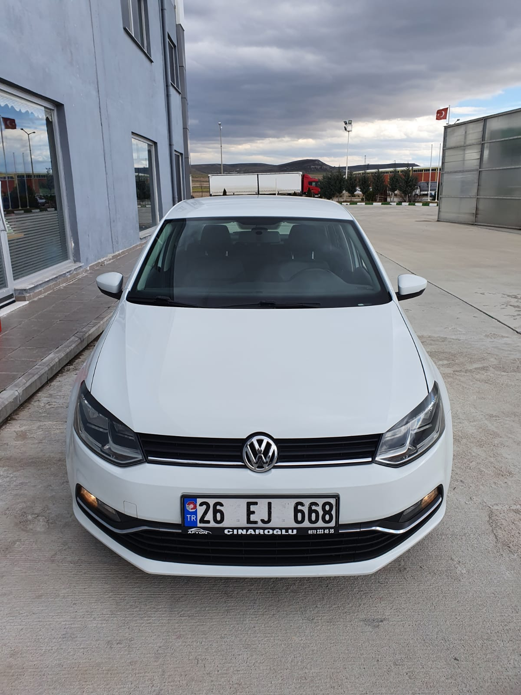
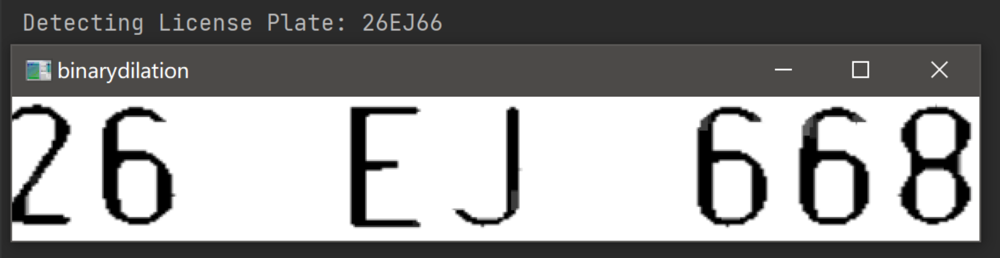
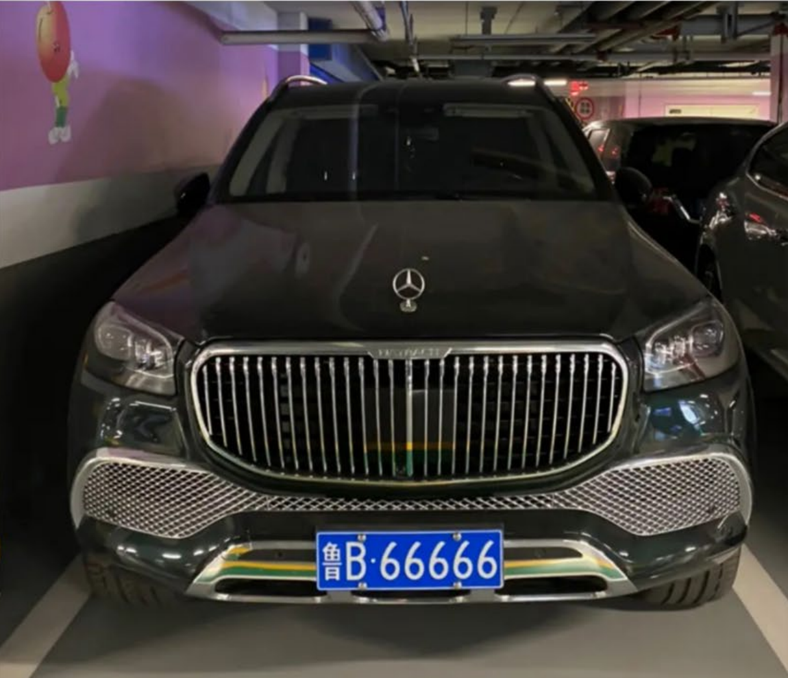
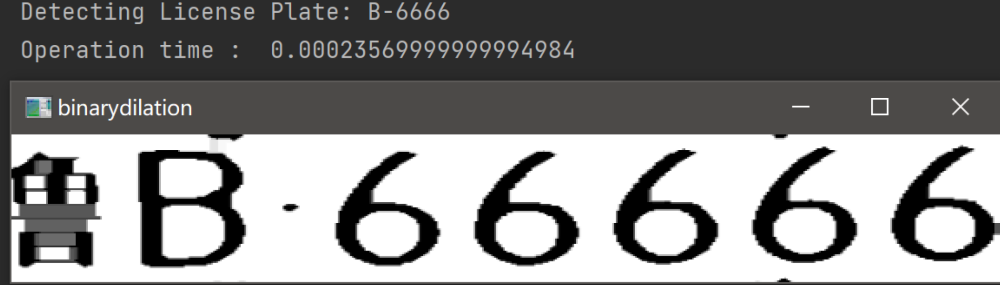
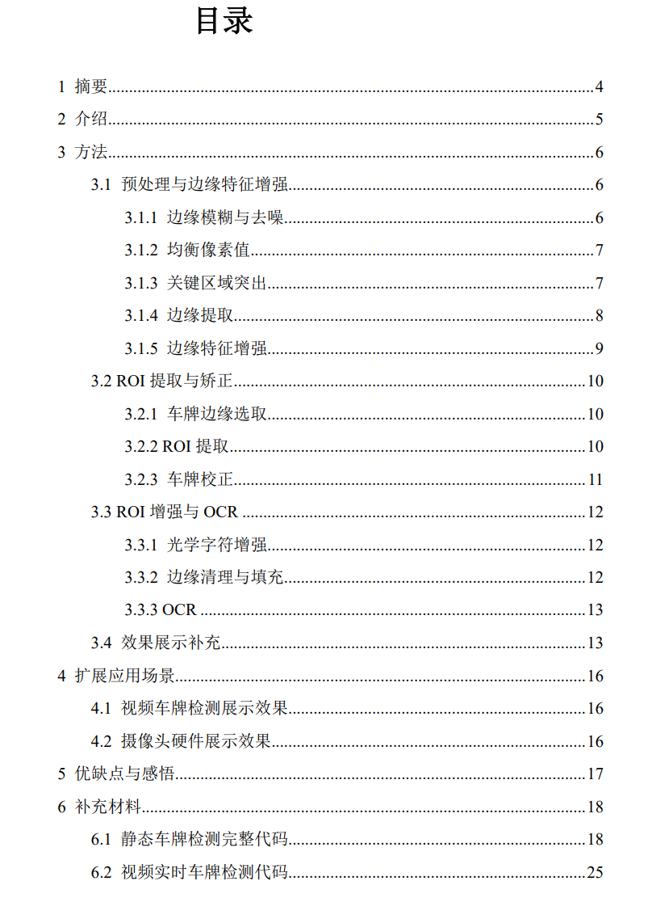

# 传统视觉方法实现车牌检测与识别

C_N_U IE 的计算机视觉课程的期中实验考核，着重于传统计算机视觉方法实现车牌检测与识别。

Mid-term examination for C_N_U IE's computer vision course focusing on traditional computer vision methods to achieve licence plate detection and recognition.


<!-- PROJECT LOGO -->
<br />

<p align="center">
  <a href="https://github.com/shaojintian/Best_README_template/">
    
  </a>

  <h3 align="center">传统视觉方法实现车牌检测与识别</h3>
  <p align="center">

</p>

 
## 目录

- [上手指南](#上手指南)
  - [开发前的配置要求](#开发前的配置要求)
  - [安装步骤](#安装步骤)
- [文件目录说明](#文件目录说明)
- [开发的架构](#开发的架构)
- [部署](#部署)
- [使用到的框架](#使用到的框架)
- [贡献者](#贡献者)
  - [如何参与开源项目](#如何参与开源项目)
- [版本控制](#版本控制)
- [作者](#作者)
- [鸣谢](#鸣谢)

### 项目结构说明

```
License_Plate_Recognition
├── LPR_chi.py
├── LPR_en.py
├── README.md
├── Real Tme LPR system.py
├── Video_LPR.py
├── README.md
├─fig
│      workflow.svg
├─image_chi
│      sample.jpg
└─image_en
        06 CGN 419.jpg
```

### 上手指南
1. 根据导入头文件安装相应包
2. 访问[https://digi.bib.uni-mannheim.de/tesseract/](https://digi.bib.uni-mannheim.de/tesseract/) 安装相应tesseract，选择其程序路径
```python
pytesseract.pytesseract.tesseract_cmd = r'D:\tesseract\tesseract.exe'
```
3. "LPR_chi.py"实现蓝底白字车牌识别,输入相应图片路径即可
```python
# todo: 国内车牌检测，国内车牌蓝底白字，特征提取不明显，因此做了额外的增强
img = cv2.imread("image_chi/sample2.png")
Plate_Recognition(img)
```
4. "LPR_chi.py"实现白底黑字车牌识别,输入相应图片路径即可
```python
img = cv2.imread("image_en/06 CGN 419.jpg")
Plate_Recognition(img)
```

5. "Video_LPR.py"实现对视频数据的车牌识别，在上方输入视频路径
```python
cap = cv2.VideoCapture('car1.mp4')
```
6. "Real Tme LPR system.py"实现使用设备摄像头实时获得车辆图像进行车牌识别

### Demo效果
传统方法实现车牌定位受图像分辨率、色偏、车距影响较大，因此很多时候需要自己调整一下
###### **白底黑字车牌效果**
白底黑字车牌效果，不知道是不是OCR的原因，白底黑字效果要好很多。
<div style="text-align:center;">
    
</div>
<div style="text-align:center;">
    
</div>


###### **蓝底白字车牌效果**
<div style="text-align:center;">
    
</div>
<div style="text-align:center;">
    
</div>


###### **视频车牌检测*
<iframe width="300" height="300" src="https://github.com/LLIKKE/License_Plate_Recognition/blob/master/video_result.mp4" frameborder="0" allowfullscreen></iframe>

### 作者

LLIKKE

为了防止滥用实验报告不选择公开，如果想要参考可以点个**star**，再发送邮件至 <wsdfn2024@163.com> 联系我。

<div style="text-align:center;">
    
</div>


